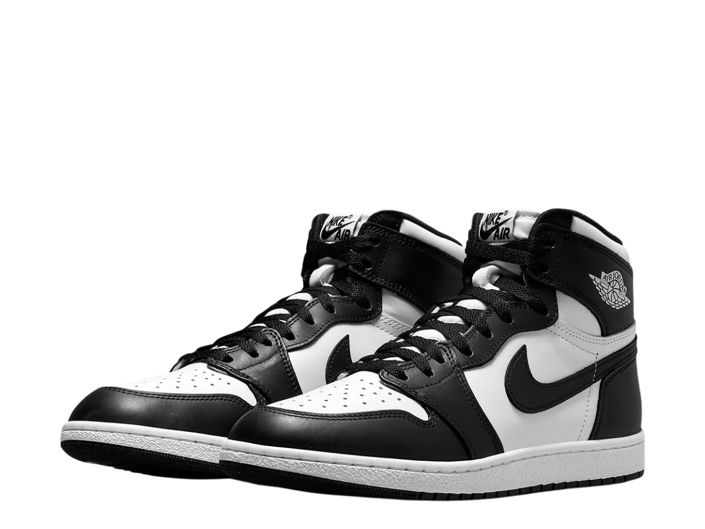
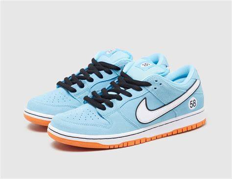

<!DOCTYPE html>
<html lang="en">
<head>
    <meta charset="UTF-8">
    <meta http-equiv="X-UA-Compatible" content="IE=edge">
    <meta name="viewport" content="width=device-width, initial-scale=1.0">
    <link rel="icon" type="image/jpg" href="image/icons.jpg">
    <link rel="stylesheet" href="style.css">
    <title>Product Layout</title>
</head>
<body>
    <h1 style="font-family:'Franklin Gothic Medium', 'Arial Narrow', Arial, sans-serif; font-style:italic; text-align:center;">Product Layout</h1>
    

        

            
            <h2>Nike Air Force 1</h2>
            
₱2,680.00

            <button style="background-color:rgb(107, 212, 107); font-family:monospace">Add to Cart</button>
        

        

            
            <h2>Nike Precision 5</h2>
            
₱2,985.00

            <button style="background-color:rgb(107, 212, 107); font-family:monospace">Add to Cart</button>
        

        

            
            <h2>Nike Alphafly Next    2</h2>
            
₱2,795.00

            <button style="background-color:rgb(107, 212, 107); font-family:monospace">Add to Cart</button>
        

        

            
            <h2>Jordan 1 Retro High</h2>
            
₱2,895.00

            <button style="background-color:rgb(107, 212, 107); font-family:monospace">Add to Cart</button>
        

        

            
            <h2>Nike SB Dunk Low</h2>
            
₱2.855.00

            <button style="background-color:rgb(107, 212, 107); font-family:monospace">Add to Cart</button>
        

    

    <h1 style="font-family:'Franklin Gothic Medium', 'Arial Narrow', Arial, sans-serif; font-style:italic; text-align:center">Employee Cards</h1>
    

        

            
            <h2>John Doe S.</h2>
            
Position: Developer

        

        

            
            <h2>Jerson D.</h2>
            
Position: Designer

        

        

            
            <h2>Loid G.</h2>
            
Position: Manager

        

        

            
            <h2>Jessy A.</h2>
            
Position: HR

        

        

            
            <h2>Morgana T.</h2>
            
Position: Sales

        

    

    <h1 style="font-family:'Franklin Gothic Medium', 'Arial Narrow', Arial, sans-serif; font-style:italic;text-align:center">Student Profiles</h1>
    

        

            
            <h2>Tanggol D.</h2>
            
Grade: A

        

        

            
            <h2>Regor C.</h2>
            
Grade: B

        

        

            
            <h2>Santino C.</h2>
            
Grade: A+

        

        

            
            <h2>Larry S.</h2>
            
Grade: C

        

        

            
            <h2>Kier P.</h2>
            
Grade: B+

        

    

    <h1 style="font-family:'Franklin Gothic Medium', 'Arial Narrow', Arial, sans-serif; font-style:italic; text-align:center">Image Gallery</h1>
    

        

            
        

        

            
        

        

            
        

        

            
        

        

            
        

    

    <h1 style="font-family:'Franklin Gothic Medium', 'Arial Narrow', Arial, sans-serif; font-style:italic; text-align:center">Testimonials</h1>
    

        

            
"Great service!"

            <h3>- Customer 1</h3>
        

        

            
"I love this product!"

            <h3>- Customer 2</h3>
        

        

            
"Highly recommend this!"

            <h3>- Customer 3</h3>
        

        

            
"Will buy again!"

            <h3>- Customer 4</h3>
        

        

            
"Excellent quality!"

            <h3>- Customer 5</h3>
        

    

</body>
</html>

/* This is for CSS */

body {
    font-family: Arial, sans-serif;
    margin: 0;
    padding: 0;
    background-color: #f4f4f4;
}

.product-container {
    display: flex;
    flex-wrap: wrap;
    justify-content: space-around;
    padding: 20px;
}

.product-card {
    background: white;
    border-radius: 5px;
    box-shadow: 0 0 10px rgba(0,0,0,0.1);
    margin: 10px;
    padding: 15px;
    flex: 0 1 calc(20% - 20px);
    text-align: center;
}

.product-card img {
    max-width: 100%;
    height: auto;
}
.student-container, .employee-container, .gallery-container, .testimonial-container {
    display: flex;
    flex-wrap: wrap;
    justify-content: space-around;
    padding: 20px;
}

.student-card, .employee-card, .gallery-item, .testimonial-card {
    background: white;
    border-radius: 5px;
    box-shadow: 0 0 10px rgba(0,0,0,0.1);
    margin: 10px;
    padding: 15px;
    flex: 0 1 calc(20% - 20px);
    text-align: center;
}

.student-card img, .employee-card img, .gallery-item img {
    max-width: 100%;
    height: auto;
}
